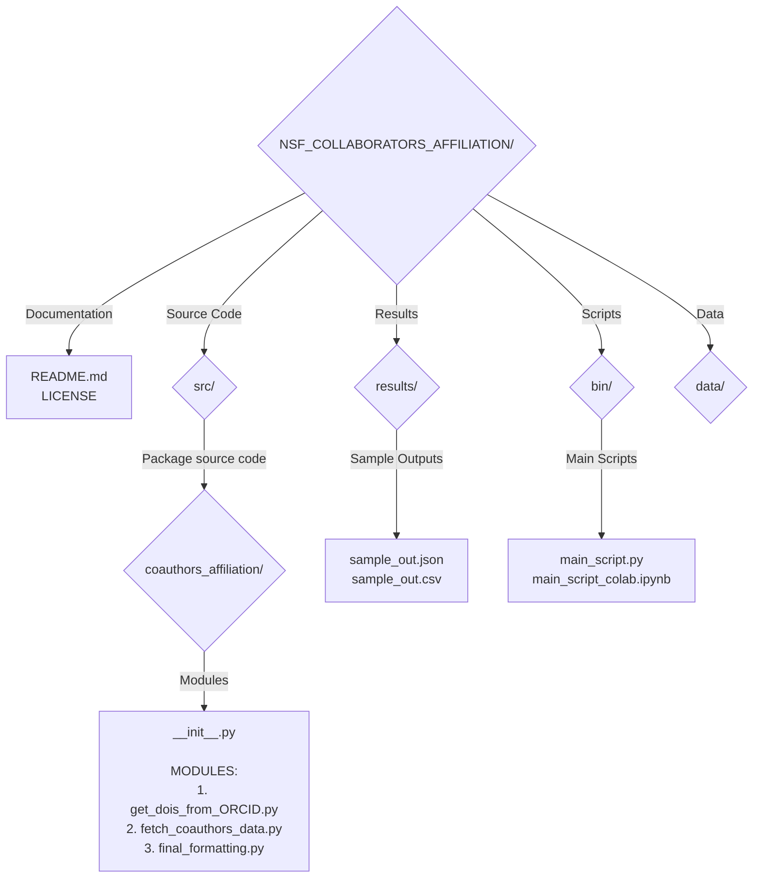

# NSF Grant Proposals: Automating Coauthors' Affiliations with Google Colab

### Overview of the coauthors requirement

National Science Foundation (NSF) grant proposals are comprehensive documents that researchers submit to be reviewed by panels of experts in the process to obtain funding for research. 

An important component of these proposals is the ***coauthors'*** affiliations table. This table presents an overview of an author's collaborative network, listing all coauthors from previous publications along with their affiliations. This table serves multiple purposes: i)**Demonstrate collaboration**, ii)**verify research community engagement**, iii)**support transparency and ntegrity**, and iv) **facilitate review process**.

However, the process of compiling a comprehensive and accurate coauthors' affiliations table can be daunting and time-consuming. It involves aggregating data from multiple publications, each potentially having numerous coauthors with varying affiliations. Manual compilation is not only prone to errors but also inefficient, especially for prolific researchers with extensive publication records.

The need for a streamlined, automated approach to generate this table would save valuable time while ensuring accuracy. This is where our GitHub repository + colab notecook, dedicated to automating the creation of the coauthors' affiliations table, comes into play. By means of this tool, researchers can significantly reduce the manual labor involved in the proposal preparation process.

### Repository Structure and Components

The repository is structured around three main modules in the "src" folder, each serving a distinct purpose in the workflow:

1. **DOI Retrieval**: The first module, `get_dois_from_ORCID.py`, makes use of  ORCID and CrossRef APIs to fetch a unique list of Digital Object Identifiers (DOIs) associated with the author's publications.

2. **Metadata Extraction**: With the DOIs in hand, the second module, `fetch_coauthors_data.py`, extracts metadata for each publication. This includes detailed information about coauthors and their affiliations, sourced from CrossRef.

3. **Final Formatting**: Recognizing the specific requirements of NSF grant proposals, the third module, `final_formatting.py`, processes the extracted data, formatting it into a table that aligns with NSF's guidelines.

### Utilizing the Code in Google Colab 

#### What is Google Colab?

Google Colab, or Colaboratory, is a free cloud-based platform that allows anyone to write and execute Python code through their browser. It is particularly favored in the data science and machine learning communities, as it provides free access to powerful resources, without requiring a setup.

Implementing Google Colab to generate the coauthors' affiliations table streamlines the process, making it more accessible, free of versions and installations. Below are detailed instructions on how to access and run the code within the Google Colab environment.

#### How to Access the Colab Notebook

To begin utilizing the repository's code in Google Colab, follow these step-by-step instructions:

1. **Navigate to the GitHub Repository**: Open your web browser and go to the GitHub page hosting the repository (`https://github.com/abelardoaguilar/NSF_collaborators_affiliation`).

2. **Locate the `main_script_colab.ipynb` Notebook**: Within the repository, navigate to the `bin` directory. Here, you will find the `main_script_colab.ipynb` notebook, which is specifically designed for use in Google Colab.

3. **Open the Notebook in Colab**: Directly above the notebook file's content, you will see a badge/link saying "Open in Colab." Click on this link. If you are not already logged into your Google account, you may be prompted to log in.

<figure>
    
</figure>

4. **Save a Copy to Your Drive (Optional)**: Once the notebook is open in Colab, you have the option to save a copy to your Google Drive for personal use and modification. Go to `File` > `Save a copy in Drive` to create your own copy.

By following these steps, you will have successfully accessed the `main_script_colab.ipynb` notebook in Google Colab, ready for execution.

#### Executing the Code in Colab

With the notebook open in Google Colab, you can begin executing the code. Here's how to proceed with running each module sequentially:

1. **Prepare the Environment**:
   - Before running any specific code from the repository, ensure that your Colab environment fulfill all dependencies. This may involve installing a few necessary Python packages. In our case, the first three lines beginning with "#!pip" should be uncommented before executing the first cell.

2. **Execute Modules Sequentially**:
   - **Module 1**: Start with the first module to fetch DOIs. Execute the cells under this section, which will require you to input an ORCID ID. The code then retrieves a list of DOIs associated with the author's publications.
   - **Module 2**: Proceed to the module for fetching coauthors' data. This section will use the list of DOIs from Module 1 to extract metadata for each publication. Follow the instructions within the notebook to execute these cells, which will generate the JSON and CSV files containing the detailed information.
   - **Module 3 (WIP)**: Finally, move on to the final formatting module. This part of the notebook takes the extracted data and formats it according to NSF's requirements for the coauthors' affiliations table.

3. **Review and Download Results**:
   - After executing all modules, review the outputs directly in Colab. The notebook will display the final table, and you will have options to download the generated files (e.g., CSV, JSON) to your local machine.

4. **Troubleshooting and Adjustments**:
   - If you encounter any issues or errors during execution, review the error messages and consult the notebook's documentation for troubleshooting tips. You can also make adjustments to the code as needed to fit your specific requirements.

### Local Execution vs. Google Colab

Despite these challenges, local execution has its advantages in certain scenarios. For long-running tasks that exceed Colab's session limits, using a local machine might be necessary. Executing our code in this way opens the option to use modules independently which may be desirable under certain scenarios:

- ***If a customized DOIs list has already been built***, then the pipeline can be used from the second step, only for metadata retrieval.

- ***If not all DOIs are required***, then the input for the second module can be filtered prior to its execution, or from the final table.

- ***If a raw and extensive version of metadata is required***, parameters for functions of the second module can be changed to obtain a extensive json/csv file with all the metadata acessible for an article.

